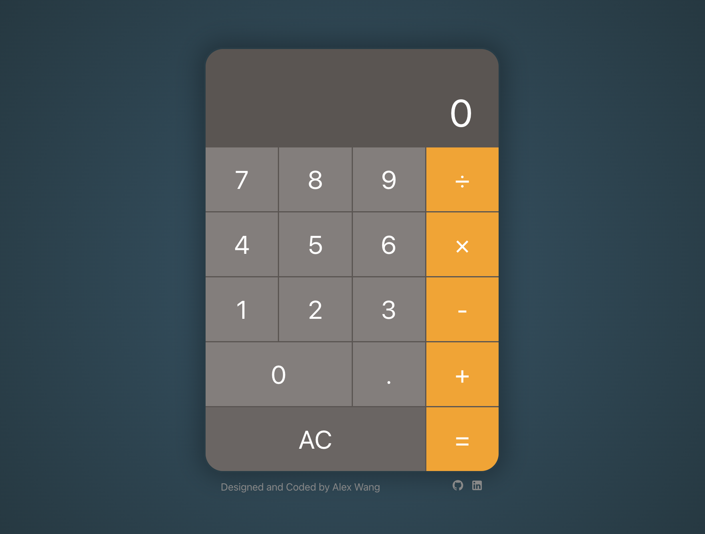

# Calculator

## Project Description

The Calculator is a web application that mimics the style of the Apple system calculator. It provides a powerful and robust calculator functionality, allowing users to perform basic arithmetic operations, handle decimal numbers, and chain multiple operations together.

### UI Overview

Here's a glimpse of the Calculator, highlighting its features and aesthetics.


*Main view of the Calculator*


## Project Features

This project showcases the following features:

- User-friendly interface that mimics the design of the Apple system calculator.
- Support for displaying the formula being calculated.
- Ability to perform basic arithmetic operations: addition, subtraction, multiplication, and division.
- Support for decimal numbers, including the ability to enter and calculate with decimal numbers.
- Powerful and robust functionality that allows users to chain multiple operations together.
- Keyboard support, allowing users to operate the calculator using keyboard keys.
- Ability to clear the input and reset the calculator state.
- Backspace functionality to modify the currently entered input.
- Accurate calculation results with support for handling precision and rounding.

## Technologies Used

The project is built using the following technologies and libraries:

- HTML
- CSS
- JavaScript
- React
- Redux Toolkit
- Vite
- CLSX
- MathJS

## Installation and Running

Follow the steps below to set up and run this project on your local environment:

### Install Dependencies
Using npm or yarn, install the project's dependencies:

```bash
npm install
# or
yarn
```
### Run the Project
Once the dependencies are installed, you can run the project using Vite:

```bash
npm run dev
# or
yarn dev
```
The application will start and by default can be accessed at http://localhost:3000.

## How to Contribute

Contributions to this project are always welcome. Here's how you can help enhance its features or make improvements:

### Fork the Repository

Start by forking the project repository, then clone your fork using:
```bash
git clone https://github.com/MarkLumenAW/project-name.git
```

### Create a New Branch

It's recommended to create a new branch for each feature or fix:

```bash
git checkout -b name-of-your-new-branch
```
### Make Your Changes

Implement your desired modifications or additions to the code.
  
### Commit Your Changes

Once done, save your changes:

```bash
git commit -m "Provide a brief description of your changes here"
```
### Push to Your Branch

Push your updates to your branch:

```bash
git push origin name-of-your-new-branch
```
### Open a Pull Request

Navigate to the original project repository on GitHub and submit a pull request. Ensure you give a detailed explanation of the changes you've made.

Your contribution will be reviewed, and if it meets the project's standards and objectives, it'll be merged. Thanks in advance for your effort and input!

## Contact Me

If you have questions or wish to discuss the project further, don't hesitate to reach out:

- **Email:** [wangpengchengnj@gmail.com](mailto:wangpengchengnj@gmail.com)
- **Personal Website:** [www.alexwang.studio](https://www.alexwang.studio)

I'm always open to feedback, collaboration, or general inquiries. Looking forward to hearing from you!
